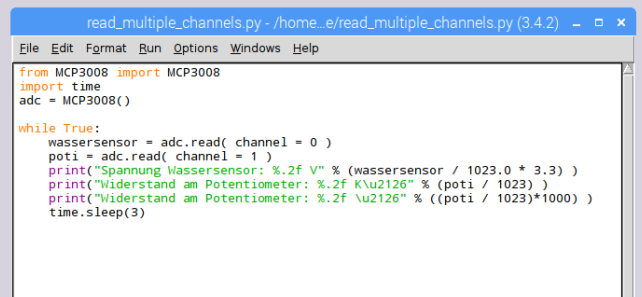

# Raspberry Pi: Raspberry Pi und MCP3008 (Analog-Digital Wandler)


## Einleitung
Viele Sensoren bieten keine digitale Schnittstelle und sind nur analog auslesbar.
Der Raspberry Pi mit seinen GPIOs kann keine analogen Signale auslesen. Um analoge Sensoren am Raspberry Pi auslesen zu könnenen, benötigen wir einen Analog-Digital Wandler z.B. den MCP3008. Damit können bis zu 8 analoge Eingänge über den SPI Bus am Raspberry Pi ausgelesen werden.

## Vorbereitung
```
sudo apt-get update
sudo apt-get upgrade
sudo apt-get install python-dev git
```

### Hinweis Rasperry Pi Zero bzw. bei Raspbian Stretch Lite
Das PHP-Modul **spidev** muss noch händisch installiert werden!

```
sudo apt-get install python-pip
sudo pip install spidev
sudo apt-get install python3-dev
sudo apt-get install python3-pip
sudo pip3 install spidev
```

Aktiviere den SPI Bus über die Config-Oberfläche: `sudo raspi-config`


Starte danach zur Sicherheit das System neu (Reboot).

### Bei der grafischen Oberfläche
Bevor es weiter geht, muss der SPI Bus noch aktiviert werden, wenn das noch nicht geschehen ist. Aktiviere in der Konfiguration des Raspberry Pi unter dem Punkt „Schnittstellen“ die Option „SPI“. Starte danach zur Sicherheit das System neu (Reboot).


## weiter für alle Versionen des Raspberry Pi

Lade dir jetzt das passende Github-Repository für raspberry-pi-mcp3008 herunter

```
cd Documents
git clone https://github.com/pediehl/raspberry-pi-mcp3008.git
```


Bevor es weiter geht, muss der SPI Bus noch aktiviert werden, wenn das noch nicht geschehen ist. Aktiviere in der Konfiguration des Raspberry Pi unter dem Punkt „Schnittstellen“ die Option „SPI“. Starte danach zur Sicherheit das System neu (Reboot).


## Aufbau


MCP3008         | Raspberry Pi       | Raspberry Pi GPIO-PINS
----------------|--------------------|-----------------------
MCP3008 VDD     | Raspberry Pi 3.3 V | 3.3V
MCP3008 VREF    | Raspberry Pi 3.3 V | 3.3V
MCP3008 AGND    | Raspberry Pi GND   | GND
MCP3008 CLK     | Raspberry Pi SCLK  | GP 11
MCP3008 DOUT    | Raspberry Pi MISO  | GP 9
MCP3008 DIN     | Raspberry Pi MOSI  | GP 10
MCP3008 CS/SHDN | Raspberry Pi CE0   | GP 8
MCP3008 DGND    | Raspberry  Pi GND  | GND

## Beispiele starten

Auf deinem Raspberry solltest du jetzt unter Documents einen weiteren Ordner  haben. Öfnne den Ordner raspberry-pi-mcp3008 und gehe auf code. Hier gibt es zwei Python-Skripte:

read_multiple_channels.py (Beispieldatei- nur diese Datei ausführen !)

MCP3008.py (notwendige Python-Klasse - muss sich im gleichen Verzeichnis befinden)

## Wie starte ich das Python-Skript auf meinem Raspbery Pi?

Wechsel in den Ordner Documents/raspberry-pi-mcp3008/code/
Wähle die Datei "read_multiple_channels.py", mach einen Klick mit der _rechten Maustaste_. Das Kontext-Menü erscheaint.


Wähle hier bitte **Python3(Idle)**.



Starte das Programm mit F5.

## Aufbau Foto-Widerstand (LDR)
### Material
* Kabel
* Photo-Zelle
* Widerstand 10 KOhm

Der Widerstand wird benötigen um einen Spanungsteiler aufzubauen. Besser: Über den Widerstand wird dafür gesorgt, dass nicht zu viel Spannung auf dem MCP3008 ankommt.


## Aufbau Potentiometer
### Material
* Kabel
* Potentiometer


